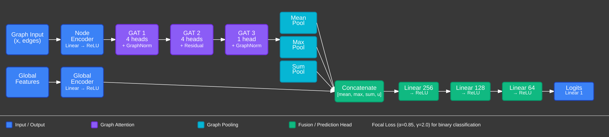

# BioEMU Pocket Discovery

**Ensemble-based druggable pocket detection using BioEMU conformational ensembles and Attentive Graph Neural Networks.**

> *Extended from class demo presentation for course CS8803: Machine Learning for Graphs at Georgia Tech*
> *Aaryesh Deshpande · May 2026*

> [!NOTE]
> The src and notebooks 1 and 2 are extensions and refactor of the original class demo notebook, which is also included for reference.  The new code is modularised into a reusable API and includes some additional features. The original notebook can be found in `notebooks/original_implementation_notebook_ensemble.ipynb`.

> This is just a proof-of-concept implementation to demonstrate the potential of ensemble-based methods and GNNs for pocket detection.  It is not intended as a production-ready tool, and there are many avenues for improvement (e.g. more principled evaluation, hyperparameter tuning, additional features).  The focus is on illustrating the end-to-end pipeline and key methodological choices.

---

## Overview

Static protein structures capture a single conformation.
Since Proteins are dynamic they continuously sample conformational states, and many
therapeutically relevant binding sites, **cryptic pockets** only appear in transient
states that are invisible in a single structure.

This project builds an proof-of-concept of a downstream application of ensemble generation methods into an end-to-end pipeline:

```
BioEMU conformational ensemble
        │
        ▼
 EnsemblePocketFinder         MDAnalysis · clustering · spatial hashing
        │
        ▼
 PocketGraphBuilder           residue-level graphs with physico-chemical features
        │
        ▼
 AttentivePocketGNN           GAT · GraphNorm · focal loss · Platt calibration
        │
        ▼
 Ranked druggable pockets     scored, calibrated probabilities
```



**Key result:** the GNN successfully separates persistent druggable pockets from
cryptic/non-druggable sites, demonstrating that conformational ensemble information
meaningfully improves pocket quality ranking beyond single-structure methods.

---

## Background

### Why ensembles?

Conventional pocket-finding tools (FPocket, SiteMap, DoGSiteScorer) operate on
a single structure.  They miss pockets that only open in minor conformational
populations, in reality these cryptic sites account for ~20 % of known drug targets
(Cimermancic et al., 2016).

Molecular Dynamics (MD) can sample ensembles but is slow: a meaningful trajectory
for a 50-residue protein requires hours of GPU time.

### BioEMU

[BioEMU](https://www.biorxiv.org/content/10.1101/2024.12.05.626885v1) is a
generative deep learning model that directly samples the **Boltzmann equilibrium
distribution** of protein conformations with no simulation required.  It generates
200 conformations in ~1 minute on a single GPU, compared to ~10 hours of MD, a
**10,000× speedup** while preserving thermodynamic accuracy.

---

## The Pipeline in Detail

### Stage 1 · Pocket Detection (`EnsemblePocketFinder`)

For each frame in the BioEMU trajectory:

1. **Cα distance matrix** `D ∈ ℝⁿˣⁿ` is computed.
2. **Candidate selection:** residue `i` is a candidate if
   - its contact count `|{j : D_{ij} < r_cut}|` falls within `[n_lo, n_hi]`
   - its distance from the molecular centroid falls within `[d_lo, d_hi]`
   - thresholds are size-adaptive (DBSCAN for proteins ≤ 20 aa; Ward for larger)
3. **Clustering:** Ward hierarchical clustering with threshold `t = max(6 Å, 1.5·R_g)`
   groups candidates into spatial pocket clusters.
4. **Characterisation:** each cluster is annotated with size, mean hydrophobicity,
   aromaticity, burial depth, and estimated volume.

#### Persistent vs. cryptic classification

Each pocket centroid is projected onto a 3D spatial hash grid (bin size `b = 0.5 Å`).
A pocket is **persistent** if its bin appears in ≥ `τ = 30%` of frames:

$$\text{is}_\text{cryptic}(p) = \mathbf{1}\!\left[\frac{\lvert\{f : \text{centroid}(p,f) \in \text{bin}(p)\}\rvert}{N_\text{frames}} < \tau\right]$$

This mirrors the operational definition from Cimermancic et al. (2016) and
Vajda et al. (2018).

---

### Stage 2 · Graph Construction (`PocketGraphBuilder`)

Each detected pocket is converted to a `torch_geometric.data.Data` object.

#### Node features (30-dim)

| Dimensions | Feature | Motivation |
|:---:|---|---|
| 0–19 | One-hot amino-acid type | Residue identity |
| 20 | Kyte–Doolittle hydrophobicity / 5 | Desolvation driving force |
| 21 | Aromatic flag | π-stacking interactions |
| 22 | Polar flag | H-bond donor/acceptor capacity |
| 23 | Charged flag | Electrostatic complementarity |
| 24 | Small residue flag | Pocket shape/flexibility |
| 25 | Branched residue flag | Steric bulk |
| 26 | Relative burial depth | Enclosure of the site |
| 27 | Relative neighbour count | Local packing density |
| 28 | Relative distance to pocket centroid | Position within pocket |
| 29 | log(1 + neighbour count) | Log-compressed density |

#### Edge features (4-dim)

Edges connect residues within 10 Å (bidirectional).

| Dim | Feature | Formula |
|:---:|---|---|
| 0 | Distance kernel | $1/(1+d_{ij})$ |
| 1 | Hydrophobic potential | $h_i h_j / 25$ |
| 2 | Electrostatic | $-q_i q_j$ |
| 3 | Aromatic–aromatic | $\mathbf{1}[\text{both aromatic}]$ |

#### Global pocket descriptor (11-dim)

Pocket-level geometric and chemical summary passed to the global encoder branch:

$$\mathbf{u} = \left[\frac{n}{20},\ \frac{V_\text{hull}}{1000},\ \frac{A_\text{hull}}{500},\ \kappa,\ \rho_q,\ \phi_\alpha,\ \phi_\beta,\ \sigma_\text{flex},\ \bar{h},\ f_\text{arom},\ \frac{\sigma_\text{depth}}{10}\right]$$

where $\kappa = V_\text{hull}/A_\text{hull}$ is compactness, $\rho_q$ is charge density, and
$\phi_{\alpha/\beta}$ are helix/sheet propensities.

#### Druggability target score

A heuristic composite score (binarised at 0.5 before training):

$$s = 0.20\, s_\text{size} + 0.20\, s_\text{vol} + 0.20\, s_\text{hydro} + 0.15\, s_\text{compact} + 0.10\, s_\text{charge} + 0.15\, p_\text{persist}$$

where each $s_{\cdot}$ is a Gaussian or clamped score centred on empirically-optimal
drug-pocket values (Halgren 2009; Schmidtke & Barril 2010), and $p_\text{persist} \in \{1.0, 0.3\}$.

---

### Stage 3 · Attentive GNN (`AttentivePocketGNN`)

```
NodeEncoder        Linear(30 --> 128) --> ReLU --> Dropout
GAT-1              GATConv(128 --> 128, 4 heads) + GraphNorm
GAT-2              GATConv(128 --> 128, 4 heads) + GraphNorm + residual
GAT-3              GATConv(128 --> 128, 1 head)  + GraphNorm
Readout            MeanPool ‖ MaxPool ‖ SumPool  -->  3 × 128

GlobalEncoder      Linear(11 --> 64) --> LayerNorm --> ReLU --> Dropout --> Linear(64 --> 32)

Fusion             [3×128 ‖ 32]  -->  Linear(416 --> 256) --> LN --> ReLU --> Drop
                                 -->  Linear(256 --> 128) --> LN --> ReLU --> Drop
                                 -->  Linear(128 --> 64)  --> LN --> ReLU
                                 -->  Linear(64 --> 1)   -->  logit
```

#### Graph Attention (GAT)

Each attention head computes:

$$\alpha_{ij} = \text{softmax}_j\!\left(\text{LeakyReLU}\!\left(\mathbf{a}^\top [\mathbf{W}\mathbf{h}_i \,\|\, \mathbf{W}\mathbf{h}_j \,\|\, \mathbf{W}_e \mathbf{e}_{ij}]\right)\right)$$

$$\mathbf{h}_i' = \sigma\!\left(\sum_{j \in \mathcal{N}(i)} \alpha_{ij} \mathbf{W} \mathbf{h}_j\right)$$

Edge features are incorporated via $\mathbf{W}_e \mathbf{e}_{ij}$, allowing the model to
weight contacts by their physicochemical character, not just topology.

#### GraphNorm

Standard BatchNorm conflates statistics across graphs of different sizes.
GraphNorm (Cai et al., NeurIPS 2021) normalises per graph:

$$\hat{h}_i = \frac{h_i - \alpha \cdot \mu_G}{\sigma_G + \epsilon}, \quad \mu_G = \frac{1}{|\mathcal{V}|}\sum_{i \in \mathcal{V}} h_i$$

where $\alpha$ is a **learnable** per-instance shift that controls how much the
per-graph mean is subtracted — preventing over-normalisation of small graphs
(e.g. 3-residue pockets from miniproteins).

#### Focal Loss

Class imbalance: druggable pockets are a minority.  Standard BCE assigns equal
weight to easy negatives, which dominate gradients.  Focal Loss (Lin et al., ICCV 2017):

$$\mathcal{L}_\text{focal} = -\alpha_t (1 - p_t)^\gamma \log p_t$$

- $\alpha = 0.85$ upweights the positive (druggable) class
- $\gamma = 2.0$ down-weights easy, well-classified examples
- Together they focus learning on hard, minority-class pockets

#### Multi-scale readout

Mean, max, and sum graph pooling are concatenated before the fusion head,
capturing complementary statistics:
- **mean**: average residue character
- **max**: most prominent feature present in any residue
- **sum**: total pool of features (scales with pocket size)

---

### Stage 4 · Calibration & Threshold Selection

Raw GNN logits are calibrated with **Platt scaling**: a logistic regression fit
on validation-set logits maps them to proper probabilities.

The optimal classification threshold is selected by:

1. Sweep all unique predicted probabilities as candidate thresholds.
2. Choose the threshold $\hat{\tau}$ that maximises F1 subject to precision ≥ 0.50:
   $$\hat{\tau} = \arg\max_{\tau} F_1(\tau) \quad \text{s.t.} \quad \text{Precision}(\tau) \geq 0.50$$
3. Fall back to Youden's J ($= \text{TPR} - \text{FPR}$) if no threshold satisfies the constraint.

---

## Installation

This project is managed with [**uv**](https://docs.astral.sh/uv/)
Python package manager.

```bash
# Clone
git https://github.com/Aaryesh-AD/ensemble-pocket-finder.git
cd ensemble-pocket-finder

# Install uv (if not already installed)
curl -LsSf https://astral.sh/uv/install.sh | sh

# Create virtual environment and install all dependencies
uv sync

# Activate the environment
source .venv/bin/activate
```

---

## Usage

### Quick start

```bash
# Run notebook 1: BioEMU sampling + pocket detection
uv run jupyter notebook notebooks/01_bioemu_pocket_detection.ipynb

# Run notebook 2: graph construction + GNN training
uv run jupyter notebook notebooks/02_graph_gnn_training.ipynb

# To view the original class demo notebook
uv run jupyter notebook notebooks/original_implementation_notebook_ensemble.ipynb
```

### Programmatic API

```python
from pathlib import Path
from bioemu_pocket import EnsemblePocketFinder, PocketGraphBuilder, AttentivePocketGNN, Trainer

# 1. Detect pockets
finder = EnsemblePocketFinder(
    top_path="bioemu_runs/protein_g_n200_s16/topology.pdb",
    xtc_path="bioemu_runs/protein_g_n200_s16/samples.xtc",
)
pocket_data, pockets_per_conf = finder.run(max_frames=200)
finder.mark_cryptic(pocket_data, n_frames_used=200)

# 2. Build graphs
builder = PocketGraphBuilder(pocket_data)
graphs = builder.build_all()

# 3. Train GNN
import torch
from bioemu_pocket.model import FocalLoss
from bioemu_pocket.trainer import build_group_splits
import numpy as np
from torch_geometric.loader import DataLoader

device = torch.device("cuda" if torch.cuda.is_available() else "cpu")

# binarise targets
for g in graphs:
    g.y = torch.tensor([1.0 if g.y.item() >= 0.5 else 0.0])

y = np.array([g.y.item() for g in graphs])
train_idx, val_idx, test_idx, _ = build_group_splits(graphs, y, pocket_data)

model = AttentivePocketGNN(
    node_dim=graphs[0].x.shape[1],
    edge_dim=graphs[0].edge_attr.shape[1],
    global_dim=graphs[0].u.shape[0],
)
trainer = Trainer(model, device, FocalLoss())
trainer.fit(
    DataLoader([graphs[i] for i in train_idx], batch_size=32),
    DataLoader([graphs[i] for i in val_idx],   batch_size=64),
)

# 4. Evaluate
metrics = trainer.evaluate(DataLoader([graphs[i] for i in test_idx], batch_size=64))
print(f"Test AUROC={metrics['AUROC']:.3f}  AUPRC={metrics['AUPRC']:.3f}")
```

---

## Project Structure

```
root/
├── pyproject.toml                  uv-managed project config & dependencies
├── .python-version                  pinned Python version (3.11)
├── notebooks/
│   ├── 01_bioemu_pocket_detection.ipynb    BioEMU sampling + pocket detection
│   └── 02_graph_gnn_training.ipynb         graph construction + GNN training
├   └── original_implementation_notebook_ensemble.ipynb    original class demo notebook
├── src/
│   └── bioemu_pocket/
│       ├── __init__.py              public API
│       ├── utils.py                 AA tables, feature helpers
│       ├── pocket_finder.py         EnsemblePocketFinder
│       ├── graph_builder.py         PocketGraphBuilder
│       ├── model.py                 AttentivePocketGNN + FocalLoss
│       └── trainer.py               Trainer + calibration utilities
├── tests/
│   └── test_pipeline.py             unit tests
└── docs/
    └── pipeline.md                  extended methodology notes
```

---

## References

| Paper | Role in this project |
|---|---|
| Lin et al. (2024) *BioEMU* · [bioRxiv](https://www.biorxiv.org/content/10.1101/2024.12.05.626885v1) | Conformational ensemble generation |
| Veličković et al. (2018) *GAT* · [ICLR](https://arxiv.org/abs/1710.10903) | Graph attention layers |
| Cai et al. (2021) *GraphNorm* · [NeurIPS](https://arxiv.org/abs/2009.03294) | Per-graph normalisation |
| Lin et al. (2017) *Focal Loss* · [ICCV](https://arxiv.org/abs/1708.02002) | Imbalanced classification |
| Ba et al. (2016) *LayerNorm* · [arXiv](https://arxiv.org/abs/1607.06450) | Feature normalisation |
| Cimermancic et al. (2016) *CryptoSite* · *J. Mol. Biol.* | Cryptic pocket definition |
| Halgren (2009) *SiteMap* · *JCIM* | Druggability scoring heuristics |
| Schmidtke & Barril (2010) · *J. Med. Chem.* | Pocket volume–druggability correlation |
| Loshchilov & Hutter (2019) *AdamW* · [ICLR](https://arxiv.org/abs/1711.05101) | Optimiser |

---

## License

MIT © 2026 Aaryesh Deshpande
